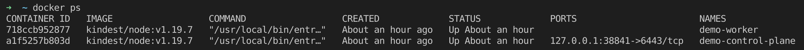

# doe-scaffold-tool-kind

## Initialize git submodules

This repo use git submodules, so you need know how manipulate them.

### git submodules ? what's that ?
Submodules allow you to keep a Git repository as a subdirectory of another Git repository. This lets you clone another repository into your project and keep your commits separate.

<p align="center"></p>

[https://git-scm.com/book/en/v2/Git-Tools-Submodules](https://git-scm.com/book/en/v2/Git-Tools-Submodules)

### Initialize submodules
Use following command in order to initialize submodules.
```shell
git submodule update --init --recursive
```

## Prerequisite

### Keep Calm And Read
Read documentation here: https://github.com/OuestFrance-Multimedia/doe-tool-bash-k8s-lab

### Install
Use following command in order to install k8s lab's tools.
```shell
make -f modules/doe-tool-bash-k8s-lab/Makefile install
```
### Prepare configuration files

#### .env file
Generate .env file just as explain here: https://github.com/OuestFrance-Multimedia/doe-tool-bash-k8s-lab#prerequisite

Example for .env file:
```bash
KIND_CLUSTER_NAME=demo
cat << EOF > .env
KIND_CLUSTER_NAME=$KIND_CLUSTER_NAME
KIND_CLUSTER_IMAGE=kindest/node:v1.19.7
KUBE_CONTEXT=kind-${KIND_CLUSTER_NAME}
NETWORK_PREFIX=143.25
METALLB_SPEAKER_SECRET_VALUE=$(openssl rand -base64 256|tr -d '\n')
EOF
```

#### kind-config.yaml
Generate kind-config.yaml file just as explain here: https://github.com/OuestFrance-Multimedia/doe-tool-bash-k8s-lab#configuration

Example for kind-config.yaml file:
```bash
cat << EOF > kind-config.yaml
---
kind: Cluster
apiVersion: kind.x-k8s.io/v1alpha4
nodes:
- role: control-plane
- role: worker
EOF
```

### Create Symbolic Links
.env and kind-config.yaml are used by `modules/doe-tool-bash-k8s-lab`, so we need symbolic links.

Use following command in order to create required symbolic links.
```shell
make create-symbolic-links
```

## Create Cluster
In order to create a kubernetes cluster thanks kind, we need :
- create a docker network with: subnet, gateway etc
- create a kubernetes cluster
- deploy a container resource metrics - [Metrics Server](https://github.com/OuestFrance-Multimedia/doe-tool-bash-k8s-lab#metrics-server)
- deploy a Load Balancer implementation - [MetalLB](https://github.com/OuestFrance-Multimedia/doe-tool-bash-k8s-lab#metallb)
- deploy a Ingress controller - [Nginx Ingress Controller](https://github.com/OuestFrance-Multimedia/doe-tool-bash-k8s-lab#nginx-ingress-controller)

### Create a docker network
```shell
make create-docker-network
```

You can inspect what's append ...
<p align="center"></p>

### Create a kubernetes cluster
```shell
make create-kind
```

You will show  the following output
<p align="center"></p>


You can show 2 containers :
- demo-control-plane


<p align="center"></p>


### Deploy a container resource metrics - [Metrics Server](https://github.com/OuestFrance-Multimedia/doe-tool-bash-k8s-lab#metrics-server)
```shell
make deploy-metrics-server
```
### Deploy a Load Balancer implementation - [MetalLB](https://github.com/OuestFrance-Multimedia/doe-tool-bash-k8s-lab#metallb)
```shell
make deploy-metallb
```
### Deploy a Ingress controller - [Nginx Ingress Controller](https://github.com/OuestFrance-Multimedia/doe-tool-bash-k8s-lab#nginx-ingress-controller)
```shell
make deploy-nginx-ingress-controller
```

## Destroy Cluster
Use following command in order to destroy cluster.
```shell
make destroy-cluster
```

## Prepare your App 

### Import as submodules content-app & platform-configuration-helm

#### content-app
Syntax:
```shell
git submodule add --branch master git@${HOST}:${GROUP}/${PATH}/${TEAM}/content-app-${APP}.git modules/content-app-${APP}
```

Example:
```shell
git submodule add --branch demo https://github.com/OuestFrance-Multimedia/doe-scaffold-content-app.git modules/content-app-demo
```

#### platform-configuration-helm
Syntax:
```shell
git submodule add --branch unrestricted git@${HOST}:${GROUP}/${PATH}/${TEAM}/platform-configuration-helm-${APP}.git modules/platform-configuration-helm-${APP}
```

Example:
```shell
git submodule add --branch demo https://github.com/OuestFrance-Multimedia/doe-scaffold-platform-configuration-helm.git modules/platform-configuration-helm-demo
```

### Create env file
Use following command in order to create your App env's file.

Example:
```shell
cat << EOF > app1.env
APP=app1
EOF
```

---
Somes predefined variables are defined into file: `common.env`

Theses variables are used during build & deploy steps.

| var                          	| definition                               	| more                                       	                                      | example                  	                                                                    |
|------------------------------	|------------------------------------------	|---------------------------------------------------------------------------------- |---------------------------------------------------------------------------------------------- |
| KIND_NODES            	      | nodes that will accommodate pods        	| substract from nodes list control-planes                                          | kind get nodes --name ${KIND_CLUSTER_NAME}|grep -v control-plane                              |
| DOCKER_BUILD_REPOSITORY       | container repository 	                    | the choice is arbitrary and predictable (image will be pushed into kind registry) | docker.io/ofm/\${APP}${APP_SUFFIX:+-$APP_SUFFIX}                	                              |
| DOCKER_BUILD_TAG              | container tag 	                          | the choice is arbitrary and predictable (image will be pushed into kind registry) | ((git ls-files -o --exclude-standard -z \| xargs -r0 cat) && git rev-parse --verify HEAD && git diff --patch-with-raw | cat) \| sha1sum \| cut -d" " -f1	 |
| DOCKER_BUILD_CONTEXT          | build context 	                          | this field is predictable                                                         | $(pwd)/modules/content-app-$APP               	                                              |
| DOCKER_BUILD_DOCKERFILE       | dockerfile 	                              | this field is predictable                                                         | $(pwd)/modules/content-app-$APP/build/Dockerfile               	                              |
| HELM_NAMESPACE                | namespace that will accommodate pods 	    | this field is predictable                                                         | \${APP}${APP_SUFFIX:+-$APP_SUFFIX}               	                                            |
| HELM_RELEASE                  | helm release 	                            | this field is predictable                                                         | \${KIND_CLUSTER_NAME}-\${APP}${APP_SUFFIX:+-$APP_SUFFIX}                                        |
| HELM_CHART                    | helm chart 	                              | this field is predictable                                                         | $(pwd)/modules/platform-configuration-helm-$APP               	                              |
| HELM_VALUES_01                | helm values file (common for each env)    | this field is predictable                                                         | $(pwd)/modules/platform-configuration-helm-$APP/values.yaml                                   |
| HELM_VALUES_02                | helm values file 	                        | this field is predictable                                                         | \$(pwd)/modules/platform-configuration-helm-\$APP/values-kind${APP_SUFFIX:+-$APP_SUFFIX}.yaml |
| HELM_SET_01                   | helm set value for image.repository 	    | this field is predictable                                                         | "image.repository=$DOCKER_BUILD_REPOSITORY"               	                                  |
| HELM_SET_02                   | helm set value for image.tag 	            | this field is predictable                                                         | "image.tag=$DOCKER_BUILD_TAG"              	                                                  |

#### Build Process

Build Process will [Build images with BuildKit](https://docs.docker.com/develop/develop-images/build_enhancements/)


You can add arguments or secrets into your App env's file

##### Add some arguments
You can use 20 arguments in following range: [01-20]

Example:
```shell
DOCKER_BUILD_ARG_01="ENV=prod"
DOCKER_BUILD_ARG_02="APP_ENV=prod"
```
##### Add some secrets
You can use 20 secrets in following range: [01-20]

Example:
```shell
DOCKER_BUILD_SECRET_01="id=github_token,src=/home/foo/secrets/composer_github_personal_access_token.json"
```
This example allows the user to pass secret information to be used in the Dockerfile for building docker images in a safe way that will not end up stored in the final image.

See more: [https://docs.docker.com/develop/develop-images/build_enhancements/#new-docker-build-secret-information](https://docs.docker.com/develop/develop-images/build_enhancements/#new-docker-build-secret-information)


#### Deploy Process

You can add yaml files or set parameters into your App env's file

##### Add some yaml file

Example:
```shell
HELM_VALUES_03=$(pwd)/modules/platform-configuration-helm-$APP/values-foo.yaml
```

##### Set some arguments

Example:
```shell
HELM_SET_03="image.pullPolicy=Never"
```